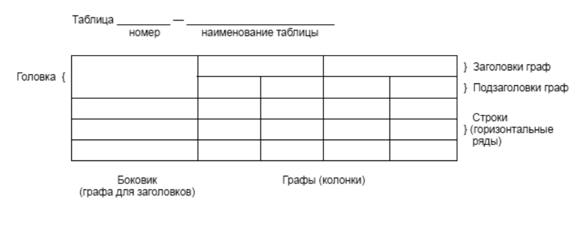
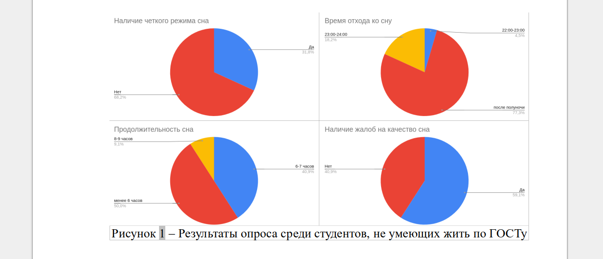
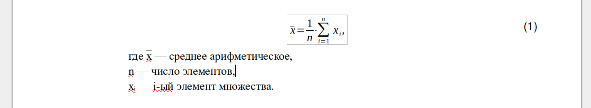
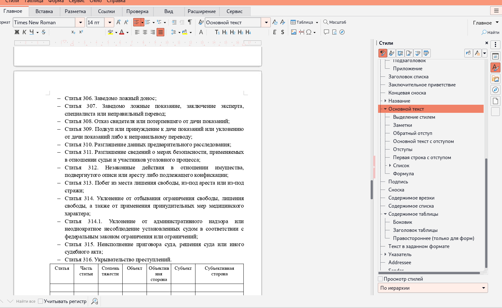
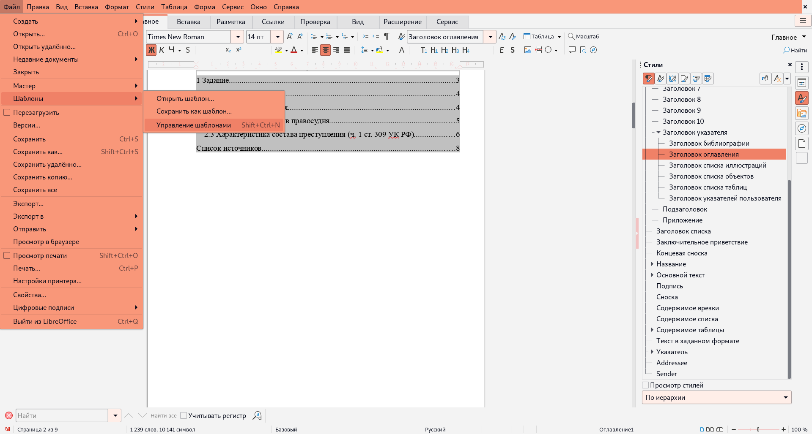
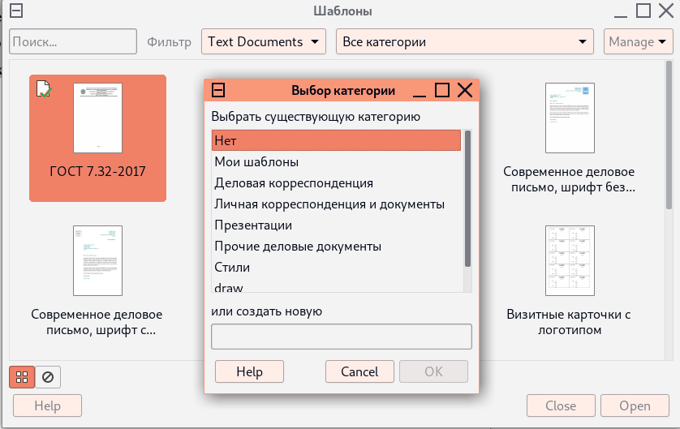
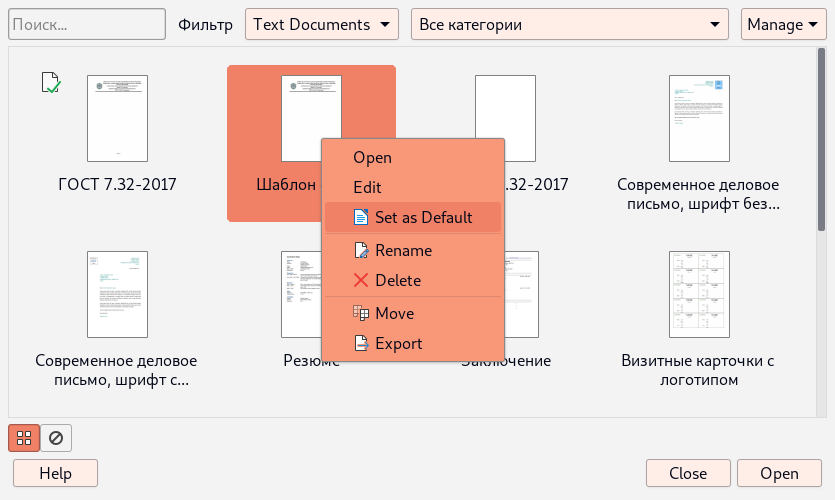

# ГОСТ порционно, <a name="top"></a>
## или Как оформить свой погост по ГОСТу

#### [[≔ Оглавление](../README.md)]

#### Содержание очерка
- [Введение](#введение-наверх)
- [Великий и ужасный ГОСТ](#великий-и-ужасный-гост-наверх)
    - [Структура документа](#структура-документа-наверх)
        - [Основная часть](#основная-часть-наверх)
        - [Приложения](#приложения-наверх)
    - [Оформление](#оформление-наверх)
        - [Основные моменты](#основные-моменты-наверх)
        - [Таблицы](#таблицы-наверх)
        - [Иллюстрации](#иллюстрации-наверх)
        - [Ссылки на источники](#ссылки-на-источники-наверх)
- [LibreOffice](#libreoffice-наверх)
- [LaTeX](#latex-наверх)
- [MMI](#mmi-наверх)
- [Сноски](#сноски-наверх)

## Введение [[↑наверх↑](#top)]
<div align="right">
Кодекс — это просто свод указаний, а не жёстких законов.

*Капитан Гектор Барбосса*
</div>

Как известно, в Индии есть священное животное – корова.

МГТУ тоже имеет своё священное животное... нет, даже не одно, а целую россыпь
сущностей, прозванных в народе государственными стандартами.

Каждый выживший на первом курсе уже крайне близко знаком с ГОСТ 2.109, возможно
знает отрывки из ~~мантр~~ 2.101 и 2.102 и наверняка попадал в лапы к 2.303
и 2.304 [[1](#1)].

В этот раз речь пойдёт о ГОСТ 7.32, он же "ОТЧЕТ О НАУЧНО-ИССЛЕДОВАТЕЛЬСКОЙ
РАБОТЕ. СТРУКТУРА И ПРАВИЛА ОФОРМЛЕНИЯ" и он же в редакции 2017 года.

Помимо него есть ГОСТ Р 7.0.97-2016, откуда часть информации перекатилась в этот очерк.

Естественно, студенты-калькуляторы любят автоматизацию, поэтому рассказ будет
содержать методы быстрого и качественного создания отчётов.

## Великий и ужасный ГОСТ [[↑наверх↑](#top)]

Ничто так не бодрит, как текст нормативных документов. Дальнейшее
повествование будет происходить из того, что запомнил автор, поэтому желательно
всё же ознакомиться с самим стандартом.

###### Полный текст стандарта в PDF [[здесь ⎘](./GOST_7_32.pdf)]

#### Структура документа [[↑наверх↑](#top)]

В оригинале (а именно в документе по ссылке выше) указана структура отчёта:

- титульный лист;
- список исполнителей;
- реферат;
- содержание;
- термины и определения;
- перечень сокращений и обозначений;
- введение;
- основная часть отчета о НИР;
- заключение;
- список использованных источников;
- приложения.

Все эти пункты должны быть оформлены в соответствии с тем, как это указано
в тексте стандарта и приложениях к нему.

Естественно, если мы пишем отчёт не о НИР, а нечто более приземлённое, то
в зависимости от работы исключаются те или иные элементы. В частности,
при написании отчёта студента по лабе или практике список исполнителей, по сути,
уходит на титульный лист.

Таким образом, обычно остаётся такая структура:

- титульный лист;
- содержание;
- введение;
- основная часть отчета;
- заключение;
- список использованных источников (если есть);
- приложения (если есть).

###### Основная часть [[↑наверх↑](#top)]

Основную часть следует делить на разделы. Разделы на подразделы.
Подразделы на пункты. Пункты на подпункты... короче, разделяй и властвуй.
Правда, дальше подпунктов уходить уже не следует.

Нумерация всего этого великолепия происходит в виде:
```
1 Раздел первый ОСНОВНОЙ ЧАСТИ
1.1 Первый подраздел первого раздела ОСНОВНОЙ ЧАСТИ
1.1.1 Первый пункт первого подраздела первого раздела ОСНОВНОЙ ЧАСТИ
1.1.2 Второй пункт ----//----
1.2 Второй подраздел первого раздела ОСНОВНОЙ ЧАСТИ
2 Второй раздел ОСНОВНОЙ ЧАСТИ

и т.д. и т.п.
```

###### Приложения [[↑наверх↑](#top)]

Приложения именуются в виде: ПРИЛОЖЕНИЕ А, ПРИЛОЖЕНИЕ Б и так далее.
В них принято отправлять крупногабаритные предметы такие, как:

- большие куски кода;
- большие картинки;
- большие таблицы;
- большие диаграммы.

#### Оформление [[↑наверх↑](#top)]
###### Основные моменты [[↑наверх↑](#top)]

Оформление по ГОСТ 7.32—2017 и ГОСТ Р 7.0.97-2016 в общем случае требует:

- шрифт не менее 12 пунктов (pt), везде одного размера;
- выравнивание по ширине (7.0.97-2016);
- межстрочное расстояние 1,5;
- абзацный отступ (отступ первой строки) 12,5 мм (1,25 см);
- поля страницы:
    - верхнее = нижнее = 20 мм;
    - правое = 15 мм;
    - левое = 30 мм;
- нумерацию страниц по центру в нижней части страницы (т.е. в нижнем колонтикуле);
- каждый структурный элемент начинать с новой страницы;
- печатать их наименования прописными буквами по центру страницы, напр. `СОДЕРЖАНИЕ`;
- нумеровать разделы, подразделы, пункты и т.д. основной части;
- печатать названия разделов:
    - либо начиная с абзацного отступа;
    - либо выравнивая по центру (7.0.97-2016).

Использовать Times New Roman ГОСТ 7.32 не требует, но рекомендует.

Разрешено использование других шрифтов для акцентирования внимания на определённых абзацах,
например, листинге программы.

###### Таблицы [[↑наверх↑](#top)]

Таблицы и иллюстрации размещаются после текста, где на них производится ссылка.

Название таблиц располагается сверху от таблицы, как на рисунке 1.
Т.е. без абзацного отступа по левому краю, после номера с Прописной буквы.

<div align="center">



Рисунок 1 – Оформление таблицы

</div>

Заголовки граф и строк таблицы следует печатать с прописной буквы.

Подзаголовки граф:
- со строчной буквы, если они составляют одно предложение с заголовком;
- с прописной буквы, если они имеют самостоятельное значение.

В конце заголовков и подзаголовков таблиц точки не ставятся.

Названия заголовков и подзаголовков таблиц указывают в единственном числе.

Разделять заголовки и подзаголовки боковика и граф диагональными линиями не допускается.

Выравнивают:
- заголовки граф — по центру;
- заголовки строк — по левому краю.

В таблице допускается шрифт меньше, чем в остальном документе.

###### Иллюстрации [[↑наверх↑](#top)]

Названия иллюстраций располагают снизу от иллюстрации, через тире от категории с номером.

Если нумерация сквозная для всего документа, то номер представляет собой просто десятичное число.

Если в каждом из разделов своя, то — номера раздела и рисунка разделённые точкой.

Сами иллюстрации должны быть расположены только после участка текста, где они были упомянуты. При этом на каждую из них должна быть хотя бы одна ссылка в тексте (с категорией и номером). Пример ссылки и рисунка приведён ниже.

Пример на рисунке 2.

<div align="center">



Рисунок 2 ‒ Результаты опроса среди студентов, не умеющих жить по ГОСТу

</div>

Здесь стоит сделать пару замечаний:

1. ГОСТ не оговаривает как конкретно располагать на странице сам рисунок, однако, на вариант "по центру без обтекания" вызывал минимум нареканий;
2. стандарт не запрещает подписывать рисунки в виде "Рисунок 2" без тире и названия.

###### Формулы [[↑наверх↑](#top)]

Формулы размещаются в отдельной строке по центру страницы. Нумерация обязательна
и производится по правому краю для каждой формулы.

Пояснения переменных и числовых коэффициентов приводят с новой строки, начиная
со абзацного отступа. На первой строке должно быть слово "где" без двоеточия.

Каждый символ поясняют в новой строке в порядке появления в формуле.

Пример на рисунке 3:
<div align="center">



Рисунок 3 – Оформление формулы

</div>

###### Ссылки на источники [[↑наверх↑](#top)]

Статья в периодических изданиях и сборниках статей:
```
<№ п/п>. <Фамилия И.О.> <Название статьи> // <Назв. период.изд.>. — <год. издания>. — № <номер>. — С. <страницы>.

```
Примеры:
```
2. Колкова Н.И., Скипор И.Л. Терминосистема предметной области «электронные информационные ресур-
сы»: взгляд с позиций теории и практики // Научн. и техн. б-ки. — 2016. — № 7. — С. 24—41.

4. Кароматов Иномжон Джураевич, Давлатова Майрам Сулеймановна Лечебные свойства лекарственного
растения одуванчик // Биология и интегративная медицина. 2018. №9.
URL: https://cyberleninka.ru/article/n/lechebnye-svoystva-lekarstvennogo-rasteniya-oduvanchik (дата обращения: 19.05.2022).
```
Книги, монографии:
```
<№ п/п>. <Фамилия И.О.> <Название>. — <город, год издания>. — С. <кол-во страниц>.
```
Пример:
```
1. Земсков А.И., Шрайберг Я.Л. Электронные библиотеки: учебник для вузов. — М.: Либерея, 2003. — 351 с.
2. Костюк К.Н. Книга в новой медицинской среде. — М.: Директ-Медиа, 2015. — 430 с.
```

Тезисы докладов, материалы конференций:
```
<№ п/п>. <Фамилия И.О.> <Название> // <Назв. сборника>. — <том (опционально)>. — <город, год. издания>. — С. <страницы>.
```
Примеры:
```
1. Леготин Е.Ю. Организация метаданных в хранилище данных // Научный поиск. Технические науки: Мате-
риалы 3-й науч. конф. аспирантов и докторантов / отв. за вып. С.Д. Ваулин; Юж.-Урал. гос. ун-т. Т. 2. — Челябинск:
Издательский центр ЮУрГУ, 2011. — С. 128—132.
2. Антопольский А.Б. Система метаданных в электронных библиотеках // Библиотеки и ассоциации в меняю-
щемся мире: Новые технологии и новые формы сотрудничества: Тр. 8-й Междунар. конф. «Крым-2001» / г. Судак,
(июнь 2001 г.). — Т. 1. — М., 2001. — С. 287—298.
```

Патентная документация согласно стандарту ВОИС:
```
<№ п/п>. <???>.
```
Примеры:
```
1. BY (код страны) 18875 (№ патентного документа) С1 (код вида документа), 2010 (дата публикации).
Электронные ресурсы:
1. Статистические показатели российского книгоиздания в 2006 г.: цифры и рейтинги [Электронный ресурс]. —
2006. — URL: http://bookhamber.ru/stat_2006.htm (дата обращения 12.03.2009).
2. Прогноз научно-технологического развития Российской Федерации на период до 2030 года. — URL: http://
government.ru/media/fi les/41d4b737638891da2184/pdf (дата обращения 15.11.2016).
3. Web of Science. — URL: http://apps.webofknowledge.com/ (дата обращения 15.11.2016).
```

Нормативные документы:
```
<№ п/п>. <Название с классификацией>. — <город, издательство, год. издания>. — <кол-во страниц> с.

```
```
1. ГОСТ 7.0.96—2016 Система стандартов по информации, библиотечному и издательскому делу. Электрон-
ные библиотеки. Основные виды. Структура. Технология формирования. — М.: Стандартинформ, 2016. — 16 с.
2. Приказ Минобразования РФ от 19 декабря 2013 г. No 1367 «Об утверждении Порядка организации и
осуществления образовательной деятельности по образовательным программам высшего образования — про-
граммам бакалавриата, программам специалитета, программам магистратуры». — URL: http://www. consultant.ru/
document/cons_doc_LAW_159671/(дата обращения: 04.08.2016).
3. ISO 25964-1:2011. Information and documentation — Thesauri and interoperability with other vocabularies — Part 1:
Thesauri for information retrieval. — URL: http://www.iso.org/iso/catalogue_detail.htm?csnumber=53657 (дата обраще-
ния: 20.10.2016).
```
## LibreOffice [[↑наверх↑](#top)]

Начнём ~~же братия повесть сию~~ с наиболее ручного зверька – LibreOffice (LO) и его
родное семейство форматов.

Широко известно в узких кругах, что OpenDocument – это наш стандарт... в смысле его
ратифицировали как ГОСТ.

До сих пор остаётся загадкой, почему мы как Университет так следуем ГОСТам, но про
"ГОСТ Р ИСО/МЭК 26300-2010 Информационная технология (ИТ). Формат Open Document для офисных приложений (OpenDocument) v1.0"
у нас почему-то почти всегда забывают и требуют DOCX.

#### Методика форматирования

В LO редактирование происходит аналогично M$ Word. Однако, форматирование текста следует производить
с помощью присваивания абзацам стилей, а не локально изменять оформление текста.

Панель со стилями обычно расположена справа, как показано на рисунке 4.

<div align="center">



Рисунок 4
</div>

Присвоить абзацу стиль можно, сначала либо установив в нём курсор, либо выделив нужные абзацы,
а затем дважды щёлкнув ЛКМ по нужному стилю. При этом достаточно выделить хотя бы один символ
в абзаце, чтобы тот считался выделенным.

Так как в стиле можно указать стиль следующего абзаца, то после недолгого привыкания
работа с текстом ускоряется.

#### Использование шаблона

Естественно все эти стили надо создать и настроить. Это довольно долгий процесс.

И тут приходят на помощь шаблоны документов, где все шрифты и иные элементы уже настроены.

Шаблон по умолчанию можно задать через меню, как показано на рисунке 5.

<div align="center">



Рисунок 5
</div>

Далее при нажатии на кнопку "упраление" (на рисунке 6 ‒ "Manage") и выборе в меню
пункта "импорт" появится окошко с выбором категории.
Там можно выбрать категрию "Мои шаблоны" и нажать "ОК".

<div align="center">



Рисунок 6
</div>

Появится диалоговое окно выбора файла (очевидно, нашего шаблона).
Выбираем файл OTT. Затем стоит выбрать этот шаблон как шаблон по умолчанию (см. рисунок 7).

<div align="center">



Рисунок 7
</div>

После этого все новые документы будут создаваться из этого шаблона.

#### Ссылки на шаблоны

Шаблоны для LO по ГОСТу можно найти в репозитории:

<div align="center">
<a href="https://github.com/Fe-Ti/GOST-OTT" target="_blank">


[GOST OTT](https://github.com/Fe-Ti/GOST-OTT)

</div>

## LaTeX  [[↑наверх↑](#top)]

~~Кто знает, тот знает и сам разберётся.~~

Шаблоны от CatInCosmicSpace:

https://github.com/CatInCosmicSpace/latex-template

https://www.ctan.org/pkg/bmstu-iu8


## MMI  [[↑наверх↑](#top)]

Matomeru MI ‒ проект переводящий разметку языка схожего с языком Markdown
в файлы ODT, оформление которых соответствует ГОСТ 7.32-2017.

После столь многообещающего вступления стоит сразу заметить, что этот проект ещё
не доведён до (первого по плану) венца ‒ полного соответствия ГОСТу.

Итак, список умений MMI следующий:

- обработка:
    - параграфов текста;
    - заголовков 10 уровней;
    - моноширинного текста (блоков кода);
- создание многоуровневых нумерованных и/или маркированных списков;
- поддержка разрывов страниц;
- вставка изображений и ссылок на них.

Последний пункт имеет определённые особенности. Подробнее о них сказано в разделе с описанием синтаксиса.

В целом этого достаточно для подготовки тела отчёта без титульника, оглавления и таблиц.

#### Установка (Git)

MMI можно ставить как с помощью Git (на данный момент это "Linux only"), так и с помощью PIP.

В первом случае сначала клонируется репозиторий:

```
git clone https://gitlab.com/Fe-Ti/matomeru-mi.git
```

Затем запускается скрипт:

```
./install.sh
```

Запуск в таком случае производится через команду вида:

```
matomeru-mi -if <input file> -of <output file>
```

Например:

```
matomeru-mi -if README.md -of README.odt
```

#### Установка (PIP)
Запустите установку пакета:

```
python3 -m pip install --upgrade matomeru-mi
```

Запуск призводится с помощью команды:

```
python3 -m matomerumi -if <input file> -of <output file>
```

#### Синтаксис

В зависимости от конфигурационного файла синтаксис может меняться, однако, по умолчанию
он приближен к MD.

Абзацы разделяются 1 (или более) пустой строкой:

```
Первый абзац

Второй абзац
```

Заголовки выглядят так:

```
# Первый Уровень
## Второй уровень
########## И десятый
```

По умолчанию триггеры для списков следубщие:
```
- маркировнный список
    1. внутренний нумерованный
- тот же маркированный список
1. новый нумерованный список
2. ещё элемент нумерованного списка
```

Разрыв страницы имеет одну особенность и по умолчанию выглядеть должен так:

```
----
- - - -
------ вот этот текст не отобразится
----- короче, "не баг, а фича" (с)
```

Картинки всталяются так:

```
горизонталь:вертикаль
горизонталь:вертикаль:единицы_соотношения_сторон
```
Горизонталь:вертикаль ‒ это соотношение сторон a la 1:2 

Единицами соотношения сторон может быть ничего для первого варианта написания или cm и px для второго.

Файлы PNG при этом могут быть обработаны автоматически:
```

```

К рисунку можно сделать ссылку следующим образом:

```
%%%номер_рисунка_в_документе
```

Нумерация рисунков начинается с единицы и она едина для всего документа.

#### Ссылки
Страничка проекта на GitLab: [Matomeru MI](https://gitlab.com/Fe-Ti/matomeru-mi)

Описание синтаксиса на аглицком: [Syntax](https://fe-ti.gitlab.io/matomeru-mi/md_Syntax.html)

И документация (язык тот же): [Main page](https://fe-ti.gitlab.io/matomeru-mi/index.html)

## Сноски [[↑наверх↑](#top)]

###### 1
Слава инжграфу!

* * *

```
Copyright 2022-2023 Fe-Ti, ISCRA
```
