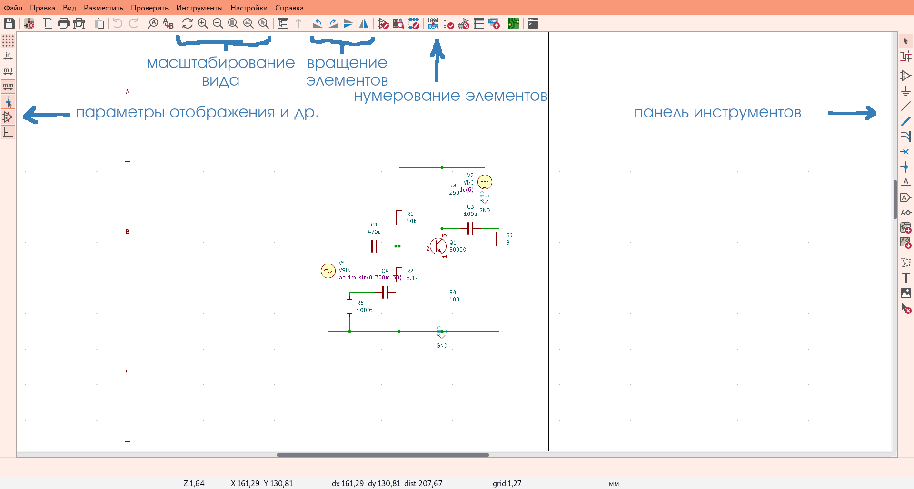
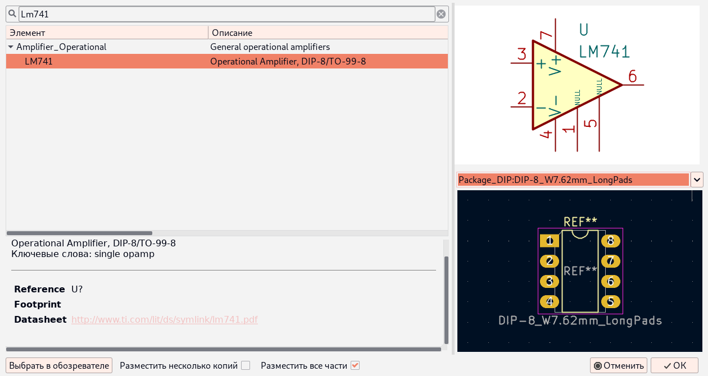
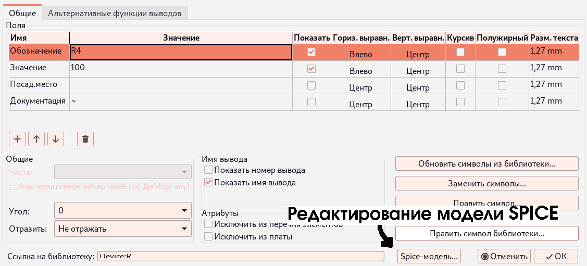
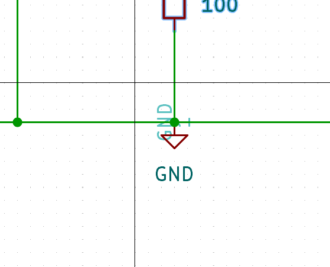
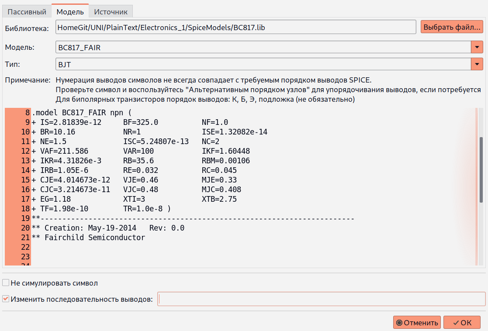

# EDA KiCAD
## v6.0

#### [[⌂ Основной файл главы](../README.md)]

----

#### Содержание
- [Введение](#введение)
- [Редактор схем](#редактор-схем)
- [Симуляция](#симуляция)
    - [АС-анализ](#ac-анализ)
    - [Переходной процесс](#переходной-процесс)
- [Нюансы симуляции элементов](#нюансы-симуляции-элементов)
    - [Пассивные элементы](#пассивные элементы)
    - [Диоды, транзисторы, ОУ и др. компоненты](#диоды-транзисторы-оу-и-др-компоненты)
    - [Источники напряжения/тока и AC-анализ](#источники-напряжения-тока-и-ac-анализ)
- [Справочный материал](#справочный-материал)
    - [Конвенция суффиксов в Ngspice](#конвенция-суффиксов-в-ngspice)
    - [Конвенции нумерации выводов элементов в Ngspice](#конвенции-нумерации-выводов-элементов-в-ngspice)

## Введение

<div align="right">

— Отлично получается!

— В каком месте отлично?

*Ходячий замок*

</div>

Использование бесплатного профессионального ПО в учебном процессе всегда было сопряжено с кучей интересных
загадок.

Особенно это изречение актуально для неопытного студента, который ещё даже толком не запомнил,
где у полевика затвор ~~, подзатвор~~, сток и исток, но который уже успел свернуть с проторенной методичками
тропинки.

А раз семестр аналоговой схемотехники закончен успешно, значит, пришло время описать моменты, на которые ушла
львиная доля времени. Для начала рассмотрим редактор схем.

## Редактор схем

Ниже на рисунке 1 представлен интерфейс редактора схем. Возврат к режиму выбора элементов
производится нажатием клавиши ESC.

<div align="center">



Рисунок 1
</div>

По умолчанию справа расположена панель инструментов.

Добавление элементов происходит через диалоговое окошко, которое вызывается
нажатием на значок операционного усилителя.

Символы R, L и C ‒ это, соответственно, резистор, индуктивность и ёмкость. Остальные
элементы находятся по маркировке. На рисунке 2 пример с поиском ОУ LM741.

<div align="center">



Рисунок 2
</div>

Переход к установке выбранного элемента происходит либо нажатием кнопки "ОК",
либо клавиши Enter (Return) на клавиатуре, либо двойным щелчком по выбранному элементу в списке.

Соединение выводов элементов происходит через нажатие ЛКМ по неприсоединённому выводу элемента.
Или с помощью инструмента добавления проводника (см. панель инструментов в редакторе).

Окно редактирования элемента вызывается двойным щелчком по символу в схеме (см. рисунок 3).

<div align="center">



Рисунок 3
</div>


## Симуляция

Симулятор под капотом KiCAD представляет собой Ngspice, который приправили графическим интерфейсом.
Перед первым запуском симуляции необходимо установить её режим и параметры.

Для корректной работы симулятора в схеме должен быть установлен нулевой потенциал.
Его можно установить с помощью символа GND (отдельный элемент схемы, см. рисунок 4).

<div align="center">



Рисунок 4
</div>

Пробником можно выбрать сигнал на схеме, а инструмент "подстройка" позволяет изменять номиналы пассивных элементов.

Далее рассмотрены доступные режимы. (секция в процессе изучения и дополнения)

#### AC-анализ

Результат частотного анализа схемы аналогичен результату работы плоттера в среде Multisim.

В этом режиме симулятор строит ЛАЧХ и ЛФЧХ для схемы.

#### Переходной процесс

Здесь происходит анализ схемы по законам Кирхгофа.

Графики строятся для тока и напряжения.

## Нюансы симуляции элементов

#### Пассивные элементы

С пассивными элементами (R, L и C) никаких нюансов нет ‒ поставили, задали значение, пронумеровали и запустили симуляцию.

#### Диоды, транзисторы, ОУ и др. компоненты

У диодов есть два момента на которые нужно обратить внимание:

1. Для симуляции нужна модель SPICE
2. Обычно нумерация выводов у посадочного места и модели симулятора не совпадает

Первое обусловлено тем, что право выбора модели и ответственность за него лежит на пользователе.
Это решается банальным поиском модели на сайте производителя (например, OnSemi) или в наборах моделей с сайта Ngspice.
Либо можно взять модели [отсюда ⎘](https://bmstu.codes/t.kravchenko/ngspice-models).

Второе обусловлено тем, что KiCAD нумерует выводы согласно нумерации в посадочном месте, а Ngspice по каким-то своим законам.
Исправить данную ситуацию помогает изменение последовательности выводов в модели SPICE (см. рисунок 5). Подробнее о
конвенциях Ngspice рассказано в разделе [Справочный материал](#справочный-материал).

<div align="center">



Рисунок 5

</div>


#### Источники напряжения/тока и AC-анализ

Для работы данного анализа необходимо указать в параметрах модели амплитуду источников переменного напряжения,
помимо указания типа сигнала, его частоты, амплитуды (да-да, тут их две) и др.

## Справочный материал

Инструкция к симулятору версии 36 &ndash; это не только 699 страниц аглицкого текста, но и кладезь довольно подробной
информации касательно работы Ngspice.

Полный текст для версии 36 [здесь ⎘](./ngspice-manual.pdf).

Далее дана лишь малая её толика.

#### Конвенция суффиксов в Ngspice

Симулятор распознаёт суффиксы при записи величин. Например:

```
10u
```

Данная запись будет означать "10 микро-...", при этом размерность физической величины зависит от параметра, куда записано данное значение (т.е. если это сопротивление, то мкОм; если это сила тока, то мкА и так далее). Суффиксы приведены в таблице 1.

Таблица 1

| Суффикс | Интерпретация |
|---------|---------------|
|    T    |     Тера      |
|    G    |     Гига      |
|   Meg   |     Мега      |
|    K    |     Кило      |
|    m    |     милли     |
|    u    |     микро     |
|    n    |     нано      |
|    p    |     пико      |
|    f    |     фемто     |


#### Конвенции нумерации выводов элементов в Ngspice

В этом подразделе описаны принципы нумерации выводов у различных элементов в симуляторе.

###### Диоды
Выводы:

1. анод
2. катод

###### Биполярные транзисторы
Выводы:

1. коллектор
2. база
3. эмиттер
4. [подложка]

###### Полевые транзисторы
Выводы:

1. сток
2. затвор
3. исток
4. [подложка]

###### Подсхемы

В подсхемах (например, операционных усилителях) выводы необходимо смотреть у каждой модели отдельно. В библиотеке моделей (ссылка на неё в одном из предыдущих разделов) обычно указаны функции выводов в комментариях к модели.


```
Copyright 2022-2023 Fe-Ti, ISCRA
```
