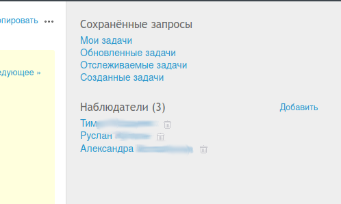

# Redmine
## v4.2.5.stable

#### [[⌂ Основной файл главы](../README.md)]

----

~~Выжившим и павшим на портале практики, НИРСов и ВКР с восьмёрки посвящается~~

#### Содержание
- [Введение](#введение)
- [Обзор интерфейса](#обзор-интерфейса)
    - [Настройка "Моей страницы"](#настройка-моей-страницы)
    - [Сторонние клиенты](#сторонние-клиенты)
        - [Мобильный клиент OpenRedmine ⎆](./OpenRedmine.md)
- [Создание и редактирование задач](#создание-и-редактирование-задач)
    - [Трекеры](#трекеры)
    - [Статусы задач](#статусы-задач)
    - [Приоритеты](#приоритеты)
    - [Исполнители и наблюдатели](#исполнители-и-наблюдатели)
- [Связи между задачами](#связи-между-задачами)
    - [Связанные задачи](#связанные-задачи)
    - [Подзадачи](#подзадачи)

## Введение

<div align="right">
Но раз есть сила воли, то все преобороть можно — и печень, и не печень.

*Иван Матвеич (Н.А. Тэффи "Сила Воли")*
</div>

Электрификация... пардон, цифровизация ‒ вещь, как известно, трудная.

Особенно труден переходный период, когда надо и электронную бумагу потратить, и целлюлозную. ~~Впрочем, вся восьмёрка это знает не понаслышке~~

Пожалуй, так надо начинать свой сказ про Redmine ‒ монстра пригретого на кафедре ИБ в роли системы учета и контроля самостоятельной работы студента.

Впрочем, монструозность его (по большей части) ‒ миф. Система представляет собой довольно гибкий таск-трекер и, что не менее важно, является свободным и проверенным временем проектом.

В этом руководстве сделана попытка кратко изложить содержание аглицкого руководства пользователя. Начнём с рассмотрения интерфейса пользователя.

## Обзор интерфейса

Среднестатистический пользователь за всю свою жизнь в Redmine видит:

 - домашнюю страницу СУПа;
 - "Мою страницу";
 - страницу со всеми проектами;
 - страницу "Обзор" для каждого;
 - страницы с таблицами задач (вкладка "Задачи");
 - список действий в каждом проекте ("Действия");
 - календарь и диаграмму Ганта в каждом проекте;
 - страницу конкретной задачи.

Пользователи с правом создавать задачи ещё видят страницу создания и редактирования.

Плюс есть ещё Wiki, но кому нужны натощак ~~ликёры~~ вики-страницы? (© Иван Матвеич)

#### Настройка "Моей страницы"

"Мою страницу" можно настраивать. Добавление новых элементов происходит через выпадающий список рядом с меткой "Добавить" (в верхнем правом углу на рисунке 1).

<div align="center">


Рисунок 1 ‒ Пример организации "Моей страницы" автора

</div>

Перемещение элементов осуществляется путём нажатия на стрелки (см. рисунок 2).

<div align="center">


Рисунок 2

</div>


#### Сторонние клиенты

Не веб-интерфейсом единым можно пользоваться для работы с СУПом. У Redmine есть множество клиентов различной степени у... удобства интерфейса. Все они собраны на [этой странице документации СУПа](https://www.redmine.org/projects/redmine/wiki/ThirdPartyTools).

Для большинства (если не для всех) требуется получить ключ API. Его можно получить на странице "Моя учётная запись", которая доступна по ссылке в верхнем меню справа. В боковой панели показанной на рисунке 3 есть графа "Ключ доступа к API", при нажатии на одну из ссылок ключ будет либо показан, либо сброшен.

<div align="center">


Рисунок 3

</div>

У следующих клиентов была проверена работоспособность:

- для Android ‒ OpenRedmine [(руководство по настройке ⎆)](./OpenRedmine.md);
- для ПК ‒ RedTimer [(TODO: руководство по настройке)](./RedTimer.md).

## Создание и редактирование задач

Задачи создаются путём нажатия на кнопку "Новая задача". Для этого пользователь должен иметь роль "Разработчик" или "Менеджер".

В редакторе (см. рисунок 4) можно задать различные параметры, дать описание,
а также установить родительскую задачу (посредством указания её номера) и т.д.

В описании используется разметка Markdown.

<div align="center">


Рисунок 4

</div>

При нажатии на кнопку "Редактировать" появится окно редактирования задачи.  Пример представлен на рисунке 5.

Текстовый блок "Примечания" служит для добавления комментария к задаче.

Для редактирования описания нужно нажать кнопку "Редактировать" напротив графы "Описание".

Чтобы принять изменения требуется нажать на кнопку "Принять".

<div align="center">


Рисунок 5

</div>

#### Трекеры

Трекеры (или очереди) позволяют характеризовать тип задачи. В СУПе Искры их пять:

| Трекер               | Описание                                    |
|----------------------|---------------------------------------------|
|Эпик                  | глобальные (!) задачи с набором подзадач    |
|Организационные задачи| задачи, касающиеся организации людей и др.  |
|Разработка            | задачи... по разработке чего-то нового      |
|Переговоры            | задачи по переговорным процессам            |
|Технические работы    | задачи по техническому обеспечению чего-либо|

Примеры:

- Конференция ISCRA Talks 2023 ‒ эпик;
- Настройка и наполнение СУП ‒ тоже эпик (т.к. надо разобраться с управлением, добавить людей, создать задачи (пока добавленный народ разбирается с управлением), написать руководство и т.д.);
- Написание данного документа ‒ это уже разработка, ибо нельзя просто так взять и ~~дойти до Мордора~~ написать руководство;
- "организовать собрание ..." или "собрать людей ..." ‒ это смело уходит к организационным задачам;
- "договориться с/о ..." ‒ переговоры;
- "найти финансирование" ‒ переговоры (ибо это равносильно поиску спонсоров);
- "проверить готовность CI" ‒ технические работы;
- "создание задач в СУП" ‒ технические работы.

#### Статусы задач

По умолчанию для задачи доступны статусы:

1. "Новая",
2. "В работе",
3. "Решена",
4. "Нужен отклик",
5. "Закрыта",
6. "Отклонена".

При создании задача имеет статус "Новая".
Его можно изменить либо через контекстное меню, либо через редактирование задачи.

Закрытие задачи происходит через присвоение статуса "Закрыта" или "Отклонена".

Условимся, что:

 - "Решена" ‒ задача имеет 100% готовность и нужна проверка результата;
 - "Нужен отклик" ‒ решение задачи застопорилось на чём-то, и требуется отклик руководителя.

#### Приоритеты

Задачам можно присваивать приоритеты. По умолчанию задан "нормальный" приоритет.

Какого-либо влияния на работу СУПа они не имеют и дают исполнителю лишь информацию о важности задачи.

#### Исполнители и наблюдатели

Задача может быть назначена какому-либо участнику проекта и тогда тот станет исполнителем.

В то же время к каждой задаче можно добавить несколько наблюдателей. Это можно сделать через панель справа (см. рисунок 6), нажав на кнопку "Добавить".

Так или иначе для указания пользователя как И. или Н. необходимо, чтобы он был участником проекта. Добавлять в проект участников может только пользователи, имеющие роль "менеджер".

<div align="center">



Рисунок 6

</div>

## Связи между задачами

После нажатия кнопки "Создать" происходит переход к просмотру новоиспечённой задачи. Здесь можно уже задать связи, которые можно разделить на две группы, о которых сказано в следующих разделах.

Здесь стоит отметить, что связывать задачи можно в пределах одного проекта (впрочем, такую функциональность можно включить в настройках администратора).

#### Связанные задачи

В Redmine есть несколько вариантов "равнозначной" связи между задачами (см. рисунок 7), каждый из которых имеет свои особенности. Они приведены в таблице 1.

<div align="center">


Рисунок 7

</div>


Таблица 1

|  Тип связи      | Описание                                                                         |
|-----------------|----------------------------------------------------------------------------------|
|  связана        |  просто указание на связь между задачами                                         |
|  скопирована в  |  просто указывает, что данная задача имеет копию, указанную в связи              |
|  скопирована из |  обратная связь для пункта выше                                                  |
|  дублирует      |  данная задача дублирует указанную в связи                                       |
|  дублируется    |  данная задача имеет дубликат, указанный в связи (обратная связь для пункта выше)|
|  блокирует      |  данная задача блокирует указанную в связи                                       |
|  блокируется    |  обратная связь для пункта выше                                                  |
|  следующая      |  указывает следующую за данной задачей                                           |
|  предыдущая     |  обратная связь для пункта выше                                                  |

Первые три связи в таблице лишь указывают на связь между задачами, в то время как остальные добавляют правила для действий между задачами. Рассмотрим это на следующем примере.

Пусть есть задачи А и Б.

1. Если А дублирует Б (и, следовательно, Б дублируется А), то:
    - при закрытии Б автоматически закроется А;
    - при закрытии А Б останется открытой.
2. Если А блокирует Б (...), то Б не может быть закрыта, пока открыта А.
3. Если в задаче А задача Б указана как следующая, то дата начала срока Б не может быть раньше первого дня после даты конца срока задачи А.

    При этом срок Б сдвигается на указанный промежуток времени (если он не указан, то считаем его равным 0), т.е. если срок А с 20.11 по 27.11 и в смещении указан 0, то начало Б будет установлено на 28 ноября вне зависимости от установленной при создании Б даты (впрочем, дата конца срока так же сдвинется).

#### Подзадачи

Нажатие кнопки "Добавить" откроет в редакторе новую задачу. При этом в поле "родительская задача" будет значиться исходная задача (её номер).

Суть такой связи сводится к следующему:

 - готовность родительской задачи есть взвешенное среднее готовности подзадач;
 - дата начала работы задачи-родителя ‒ самая ранняя дата начала у подзадач;
 - срок окончания ‒ самая поздняя дата;
 - затраченное и расчётное время ‒ сумма, соответственно времени по подзадачам;
 - Приоритет р-й задачи есть наивысший из приоритетов подзадач;
 - Сроки подзадач изменяются соответствующим образом, когда выставляется связь "следующая" или "предыдущая" между родительской задачей и какой-то ещё.

```
Copyright 2022 Fe-Ti, ISCRA
```

